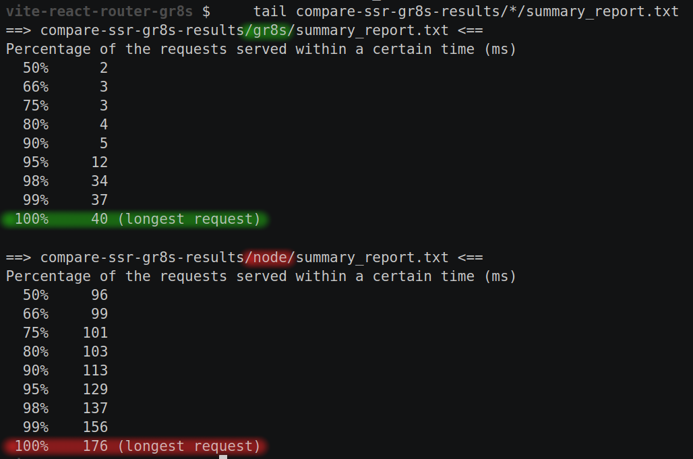
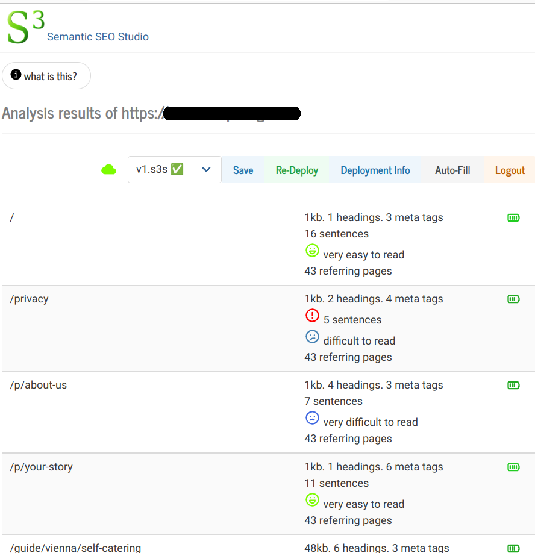

# Starter template powered by React Router & [gr8s server](https://github.com/codomatech/gr8s-server/)


## What is this?

This is a modern, production-ready template with React Router enhanced to optionally work with gr8s.

The simplest way to use it is to clone this repository and modify the sources in [app](./app). Follow the [Quick Start Guide](#quick-start-guide) for more information.

### **Wait! what is gr8s?**

gr8s is an efficient replacement of the conventional node-based server-side rendering (SSR).
it does many other things but the main thing is it replaces the need to have a node server.

### **Why would I want to use gr8s?**

because:

<details>

<summary>
🚀 your server suddenly becomes much faster and leaner.
</summary>




</details>

<details>
<summary>
💰 <a href="https://gr8s-server.codoma.tech/#offer">affordable managed hosting</a> or cheaper self hosting.
</summary>
</details>

<details>

<summary>📈 access to the free SEO editor and analyzer <a href="https://s3.app.codoma.tech/">S³ Studio</a>.</summary>



</details>

<details>

<summary> 🔥 it can even substitute the need for an expensive, chunky CMS</summary>

Currently you can write HTML code to be displayed for each page. This could cover your
needs (depending on your use case).

Also: a visual page builder is planned, [vote for the feature here](https://github.com/codomatech/gr8s-server/discussions/1).

</details>


### Why shouldn't I use gr8s?

If you prefer to stay in next.js server-side eco system: e.g. if you use server side components,
authentication services, or any thing that has to run on a node server, gr8s wouldn't be suitable for you.

Do you want to break free from vendor-lockin?
[Propose & vote for features you need here](https://github.com/codomatech/gr8s-server/discussions/1). E.g. auth services, webhooks.


<a name="quick-start-guide"></a>

### Quick Start Guide

Like every frontend app, you will need to install dependencies

```bash
pnpm install
```

Start the development server with hot-module reload (i.e. it updates the site automatically when you edit the sources):

```bash
pnpm run dev
```

Once you are happy with the app and want to deploy it, either:

#### Deploy to gr8s cloud

Use one of these commands:

- If you need to create a new account

```bash
pnpm run gr8s-deploy-signup
```

- If you already have your site's credentials

```bash
pnpm run gr8s-deploy
```

Both commands will give you a URL where your app is deployed.


#### Host on your own server

Build your docker image Using the following command (you need to have `make` installed on your system):


```bash
# export APP=<your app name>
make docker-gr8s
```

Then run the docker image using something like:

```bash
docker run --name ${APP}-gr8s -p 8338:8338 -d ${APP}-gr8s
```

You will need to configure a *data source* so gr8s can fill your pages.
please refere to [this  guide](https://github.com/codomatech/gr8s-server/blob/main/docs/walkthrough-s3.md)
for a walk through.
